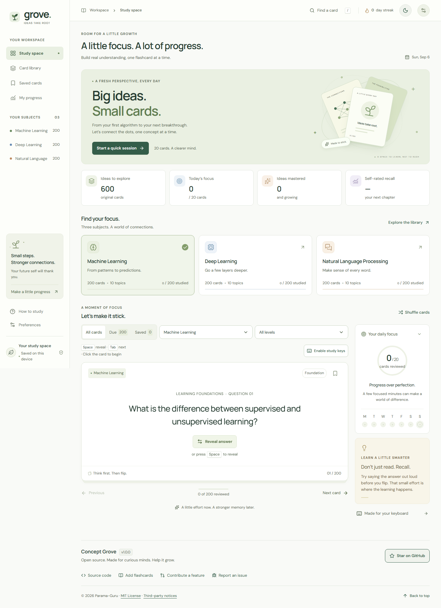
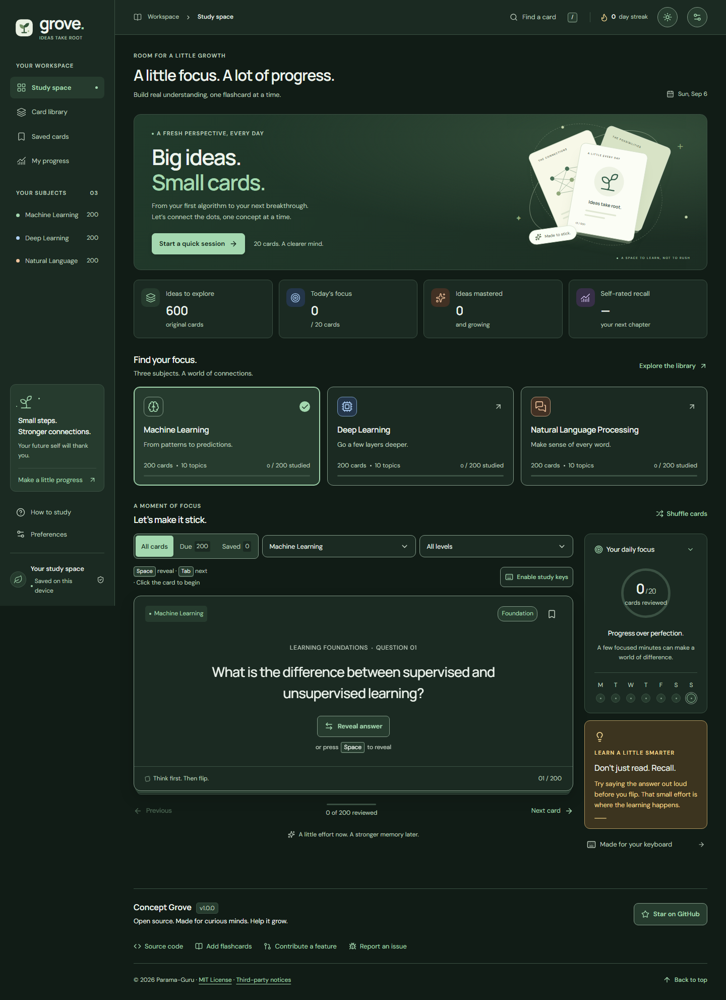

# Concept Grove

<kbd>v1.0.0</kbd> · MIT ([LICENSE](LICENSE)) · [Source on GitHub](https://github.com/Parama-Guru/concept-grove)

**Ideas take root.** A calmer, local-first study space built with **React, strict TypeScript, Vite, and Three.js**. Start with **600 original flashcards** across machine learning, deep learning, and natural language processing. The short wordmark is **grove.**; the package name is `concept-grove`.

> **[Study now — Concept Grove](https://parama-guru.github.io/concept-grove/)** · Free to use, no sign-in required. If the project helps, [give it a star on GitHub](https://github.com/Parama-Guru/concept-grove).

## Project status and future work

**v1.0.0 is released and usable for its documented local-first study scope.** The public site runs on GitHub Pages independently of this local checkout. Future improvements are not prerequisites for using the current release.

See [future-upadate.md](future-upadate.md) for dated verification evidence, the owner's suggestion inbox, proposed improvements, naming considerations, and a checklist for safely removing a local checkout. Items in that document are ideas unless explicitly marked verified; browser-local progress and VS Code chat history are not backed up to GitHub.

## A space for focused study

| Light | Dark |
| --- | --- |
|  |  |

## Start studying

For local development, use **Node.js 24 LTS and npm 11**, and open a terminal in your checkout. The existing local **flash** folder stays unchanged; it does not need to match the repository name. No backend, account, API key, or environment file is required. A published static deployment needs only a browser, not Node.js or a GitHub account.

```sh
npm ci
npm run dev -- --host 127.0.0.1
```

Open [the local study space](http://127.0.0.1:5173/). The **Concept Grove: dev** task in [.vscode/tasks.json](.vscode/tasks.json) starts the same server from VS Code. No debug configuration is required.

`npm ci` uses your configured npm registry, normally [the public npm registry](https://registry.npmjs.org/); **no private feed is required**. The committed [package-lock.json](package-lock.json) omits registry-resolved URLs while retaining locked versions and integrity information. The `private: true` setting in [package.json](package.json) prevents accidental npm publication; it does **not** make the GitHub repository private.

For a production preview:

```sh
npm run build
npm run preview -- --host 127.0.0.1 --port 4173
```

Open [the production preview](http://127.0.0.1:4173/). Serve Vite's generated output with a static host for production; the preview server is for local verification, not production hosting.

## Static hosting and GitHub Pages

The public repository is [Parama-Guru/concept-grove](https://github.com/Parama-Guru/concept-grove), and the verified website is [parama-guru.github.io/concept-grove](https://parama-guru.github.io/concept-grove/). The [initial Linux verification and deployment](https://github.com/Parama-Guru/concept-grove/actions/runs/34037456253) succeeded on September 6, 2026, including a clean install from public npm.

[vite.config.ts](vite.config.ts) uses `base: './'`, making generated JavaScript, CSS, fonts, and HTML asset URLs relative. The favicon and brand icon also respect Vite's base. The same build can be published at a site's root or a GitHub Pages project subpath without hard-coding a repository name. See [Vite's relative-base documentation](https://vite.dev/guide/build#relative-base).

Maintainers configure **Settings → Pages → Build and deployment → GitHub Actions**. The included [.github/workflows/pages.yml](.github/workflows/pages.yml) is configured to use Node.js 24, install locked dependencies and Chromium, then run `npm run check` and `npm run test:e2e`. Pull requests are checked without publishing. After successful checks on `main`, it uploads the tested static output and deploys with SHA-pinned Pages actions; only the deployment job receives `pages: write` and `id-token: write`.

For each release, verify the workflow's reported URL with a hard refresh, library filtering, lazy-loaded progress, local fonts, favicon, and optional artwork. [scripts/verify-live.mjs](scripts/verify-live.mjs) checks the public deployment in fresh desktop/mobile browser contexts, including dark appearance, keyboard controls, theme persistence, accessibility, and shipped license notices. Local subpath tests alone do not prove that GitHub Pages or Linux CI has succeeded. See [Vite's GitHub Pages guide](https://vite.dev/guide/static-deploy#github-pages) for hosting background.

This app has no URL router: views live in React state, so no SPA rewrite or custom 404 page is required. Serve the output directory intact and use the host's trailing-slash site URL so relative assets resolve inside the project subpath. A folder or brand rename does not erase progress at the same origin. Export a backup before moving from localhost to Pages, a custom domain, or another origin, then import it at the destination.

## What is included

The original baseline remains fixed; accepted community additions expand it without renumbering existing cards. New additions must keep all three subjects equally represented. See [CONTRIBUTING.md](CONTRIBUTING.md).

| Subject | Original cards | Original topics |
| --- | ---: | ---: |
| Machine learning | 200 | 10 |
| Deep learning | 200 | 10 |
| Natural language processing | 200 | 10 |

- Questions, explanatory answers, and short takeaways at foundation, intermediate, and advanced levels.
- **Study space:** reveal answers, bookmark, shuffle, filter by subject/difficulty, and switch between All, Due, and Saved cards.
- **Quick sessions:** up to 20 distinct due/new cards sampled from the combined three-subject pool.
- **Card library:** search, subject/topic/difficulty filters, answer previews, and 12-card pagination.
- **Saved cards:** a personal collection that can be studied independently.
- **My progress:** reviewed/mastered counts, review activity, streaks, daily goals, and self-rated recall.
- **Preferences:** a 10–100-card daily goal, optional animation, System/Light/Dark appearance, JSON backup/restore, and confirmed study-data reset.
- **Header and footer:** a quick light/dark toggle and contributor/project links. External links only navigate; nothing is starred or submitted automatically.
- Responsive layouts, visible keyboard focus, modal focus containment, screen-reader descriptions, and reduced-motion support.

The question bank is original revision material, not an official examination paper or a substitute for the learner's syllabus and course references.

## Library controls

- Use **Find a card** or `/` to open and focus search. Search covers questions, answers, takeaways, topics, and subjects.
- Narrow results with subject buttons and the **Difficulty** and **Topic** menus. **Clear search** removes only the query; **Clear filters** resets the whole selection.
- **Peek at answer** opens a preview without recording a review. **Save card / Unsave card** changes the bookmark; **Study card** starts a subject session at that card.
- **Previous / Next** pages through 12-card result pages. **Saved cards** provides the same controls for your bookmarked collection. These actions do not submit a review rating.

## Keyboard controls

Study keyboard mode provides these controls:

| Key | Action |
| --- | --- |
| Space | Reveal the current answer; pressing it again does not hide the answer |
| Tab / Shift+Tab | Next / previous card while study keyboard mode is active |
| Left / Right arrow | Previous / next card while study keyboard mode is active |
| 1 / 2 / 3 / 4 | Rate a revealed answer Again / Hard / Good / Easy |
| B | Toggle the current bookmark |
| / | Open and focus library search |
| Escape | Release study keyboard mode to normal Tab navigation; in a dropdown or dialog, dismiss that control instead |

Clicking the card or its study actions re-engages study keyboard mode. Tab and Shift+Tab never submit a rating, never wrap around, and cannot move beyond the first or last card; reaching a boundary leaves the current card in place. Use Escape when you want to leave study navigation and Tab through the page controls normally.

Text fields, editable content, native selects, custom comboboxes/listboxes, and open dialogs retain their normal keyboard behavior. Other controls outside the active study area remain normally keyboard-accessible. Composition/IME input and already-prevented events are not intercepted, including by the `/` search shortcut. Within dialogs, Tab and Shift+Tab cycle controls and Escape closes without saving pending preferences. The in-app **How to study** guide should match this contract.

Use **Back to question** when you want to hide an answer deliberately; Space never toggles it closed. **Enable study keys** also re-engages the study controls without a mouse.

## Appearance

**System** is the default and follows the operating system's light/dark preference, including changes while the app is open. In **Preferences → Appearance**, choose **System**, **Light**, or **Dark**, then **Save preferences**.

The header's sun/moon button switches the currently displayed palette immediately and saves an explicit Light or Dark choice. Choose **System** again in Preferences to resume following the OS. Appearance is stored separately under `concept-grove:theme:v1`; importing a study backup or resetting study data does not change it.

## Scheduling and honest statistics

The scheduler is a **simplified SM-2-inspired heuristic**, not the exact SM-2 algorithm:

- **Again:** review in 10 minutes; reset the confidence streak.
- **Hard:** at least one day, with slow interval growth; reset the confidence streak.
- **Good:** build from one day to three days, then grow according to the card's ease.
- **Easy:** start at four days and grow more quickly.
- Ease is bounded between 1.3 and 3; intervals are capped at 365 days.

**Due** includes unseen cards and cards whose due time has arrived. A study queue is a snapshot: rating a card does not remove its neighbor or skip the next question. Each card can be rated once per session, and the displayed rating buttons show its next interval.

**Mastered** means at least three consecutive Good/Easy ratings and an interval of at least seven days. **Self-rated recall** is the proportion of all recorded ratings marked Good/Easy, not measured exam accuracy. Daily counts include repeat reviews and use local calendar dates. These indicators support a study habit; they do not certify proficiency.

## Privacy, storage, and backups

Concept Grove is **frontend-only**: there is no study-data backend, analytics, tracking, or external AI service. Fonts and app assets are served locally with the site. The static host still receives normal page/asset requests; choosing an external GitHub link opens that service under its own policies.

| Browser `localStorage` key | Contents | In study backups? |
| --- | --- | --- |
| `recall-studio:v1` | Progress, bookmarks, activity, daily goal, animation preference | Yes, version 1 |
| `concept-grove:theme:v1` | System/Light/Dark appearance preference | No |

The study key intentionally keeps the previous app name. Concept Grove preserves the legacy card IDs and version-1 schema, so existing **Recall Studio version-1 backups remain compatible**. Appearance is not added to that schema.

Storage belongs to a browser/profile and origin (scheme, hostname, and port), not a folder or URL path. Development, production preview, and Pages therefore have separate progress. Renaming a local folder or changing a repository path on the same origin does not create new storage; another Pages hostname or a custom domain does. Apps on the same origin can share access to these keys, so use trusted deployments.

- Use **Preferences → Export backup** before clearing browser data or changing devices.
- Concept Grove backup downloads use the filename pattern **concept-grove-YYYY-MM-DD.json**. Existing version-1 backups remain importable regardless of their filename; the JSON schema is unchanged.
- Before changing origin, export from the original site, open the new site, then use **Preferences → Import backup** and confirm replacement there. The rename does not automatically transfer data between origins.
- Import accepts validated version-1 JSON up to 2 MiB. It rejects invalid roots/versions and ignores invalid entries or unknown card IDs. Confirmation replaces study data and study preferences, not appearance; it does not merge backups.
- Reset also requires confirmation. Canceling an import or reset leaves existing progress untouched.
- Unreadable stored data is not overwritten merely by loading or navigating the app; the next intentional study/settings change can replace it.
- If browser storage is unavailable or full, the app warns and remains usable in memory for that visit. Export a backup to keep that session's progress.

Study data has no cloud synchronization or multi-tab conflict merging; use one study tab at a time. The current session position and filters are not persisted. Browser storage and backup files are not encrypted by the app: keep backups private and never attach a real backup to a public issue.

## Browser constraints

Use a current browser with JavaScript, ES modules, and modern browser APIs such as native dialogs. Serve the app over HTTP(S), rather than opening the HTML file directly. Browser privacy settings or cleared/private profiles can prevent progress from surviving a visit.

WebGL2 is only needed for the optional artwork; study controls remain available with a static illustration. There is no service worker, guaranteed offline reload, or installable offline mode. Automated browser coverage targets Chromium on desktop and mobile emulation, not every browser or physical device; Firefox/Safari compatibility is not certified by those tests.

## Animation and performance

The artwork is generated in code: three rounded cards, painted canvas textures, simple orbits, and instanced particles. No downloaded images or 3D models are needed.

- Three.js is dynamically imported only when the artwork is visible, the document is active, and motion is allowed; initialization is deferred to idle time.
- Reduced motion, the animation preference, and the browser's data-saving hint suppress the 3D enhancement. A static illustration remains available.
- Rendering is capped at 30 fps and a 1.5 device pixel ratio. Hidden/offscreen animation pauses.
- Geometry is shared, particles are instanced, and there are no real-time shadows or postprocessing effects.
- WebGL context loss restores the static illustration. Unmounting releases GPU resources, textures, canvases, observers, listeners, and animation frames.
- React, the question bank, the progress view, and the optional scene have separate cacheable bundles. Fonts are served locally.

Known trade-off: the optional Three.js scene/renderer bundle can exceed Vite's default 500 kB chunk-warning threshold. It is lazy-loaded rather than part of the initial study bundle. Check the current build output for its size; do not hide the warning by raising the threshold.

## Verification

After `npm ci`, install the browser once, then run both required checks:

```sh
npx playwright install chromium
npm run check
npm run test:e2e
```

`check` runs Oxlint, Vitest, and strict TypeScript/production compilation. Browser tests serve production previews on ports 4173, 4174, and 4175, so **run the checks in this order after source changes** to test a fresh build. Do not leave another application running on those ports. On Linux, Chromium also needs system dependencies; the workflow uses `npx playwright install --with-deps chromium`.

Verification covers original-card and aggregate-deck invariants, scheduling, filters, backup validation, calendar statistics, and theme behavior; browser scenarios exercise study/library flows, keyboard isolation, focus, storage failures, responsive layouts, accessibility, and optional WebGL lifecycle. Production mount checks cover both `/concept-grove/` and `/GithubPages/concept-grove/`, including asset loading and refreshes. The latter is a test mount, not another published repository.

The v1.0.0 release passed **180 unit/content tests and 64 browser cases** locally, and the GitHub Linux workflow passed its clean install, build, verification, and deployment. The actual HTTPS site was also checked at 1440px and 375px using the live verification script.

Record actual command results, failures, and skips in each pull request rather than relying on these release counts. Playwright produces a local HTML report. Graphics cases may skip when their independent WebGL2 capability probe fails. Automated checks are not a complete accessibility audit or proof of compatibility with every browser/device.

## Source map

- [src/App.tsx](src/App.tsx): navigation, state persistence, app shell, and dashboard.
- [src/components/StudyWorkspace.tsx](src/components/StudyWorkspace.tsx): study queues, ratings, and keyboard controls.
- [src/components/CardLibrary.tsx](src/components/CardLibrary.tsx): searchable and saved collections.
- [src/components/SelectField.tsx](src/components/SelectField.tsx): shared accessible, styled dropdowns.
- [src/components/ProgressView.tsx](src/components/ProgressView.tsx): activity and progress metrics.
- [src/components/Dialogs.tsx](src/components/Dialogs.tsx): help, preferences, and backup flows.
- [src/lib/study.ts](src/lib/study.ts): pure scheduling, statistics, filtering, and validation.
- [src/lib/theme.ts](src/lib/theme.ts), [src/hooks/useTheme.ts](src/hooks/useTheme.ts), and [src/theme.css](src/theme.css): appearance validation, OS preference handling, separate persistence, and theme styling.
- [src/lib/ambientScene.ts](src/lib/ambientScene.ts): procedural Three.js scene and resource lifecycle.
- [src/data/machineLearning.ts](src/data/machineLearning.ts), [src/data/deepLearning.ts](src/data/deepLearning.ts), and [src/data/naturalLanguage.ts](src/data/naturalLanguage.ts): the fixed 600-card original baseline.
- [src/data/index.ts](src/data/index.ts): the aggregate deck, ID lookups, and subject metadata. Community additions use `communityCards`; the format and balance rules are in [CONTRIBUTING.md](CONTRIBUTING.md).
- [src/data/community.ts](src/data/community.ts): add new original flashcards here with explicit stable IDs; do not insert into the original decks.
- [src/types.ts](src/types.ts): shared card, subject, rating, and version-1 study-state types.
- [src/data/cards.test.ts](src/data/cards.test.ts), [src/lib/study.test.ts](src/lib/study.test.ts), [src/lib/theme.test.ts](src/lib/theme.test.ts), [e2e/app.spec.ts](e2e/app.spec.ts), and [e2e/pages.spec.ts](e2e/pages.spec.ts): verification contracts.

This is a static frontend, not a server application. React owns navigation and transient sessions; pure helpers own scheduling/validation; browser storage owns persistence. The progress view and 3D scene load on demand.

## Contribute and connect

Created by [Parama-Guru](https://github.com/Parama-Guru); community improvements are welcome. Browse [contributors](https://github.com/Parama-Guru/concept-grove/graphs/contributors), [report a bug or propose a flashcard](https://github.com/Parama-Guru/concept-grove/issues/new/choose), or follow [CONTRIBUTING.md](CONTRIBUTING.md) for a pull request. A single-card idea is welcome through the flashcard form; maintainers coordinate balanced additions.

Studying requires no account. **Starring the repository, filing issues, and opening pull requests require a GitHub account** and your explicit action on GitHub; footer links never auto-star the project.

Read [CODE_OF_CONDUCT.md](CODE_OF_CONDUCT.md) for community expectations, [SECURITY.md](SECURITY.md) for private vulnerability reporting, and [CHANGELOG.md](CHANGELOG.md) for version notes. Never report secrets or sensitive backups in public issues.

## License and third-party notices

The original code and original flashcard text are available under the **MIT license**, copyright **2026 Parama-Guru**. See [LICENSE](LICENSE); retain the copyright and permission notice when redistributing covered material.

Third-party libraries, icons, and fonts retain their own licenses. [package.json](package.json) lists dependencies, including the locally served DM Sans and Manrope font packages. Each build collects the installed runtime packages' actual license texts using [scripts/generate-notices.mjs](scripts/generate-notices.mjs) and ships them with the website; the footer links to **Third-party notices**. The build fails if a runtime package has no license text for review. The project's MIT license does not relicense these dependencies.
